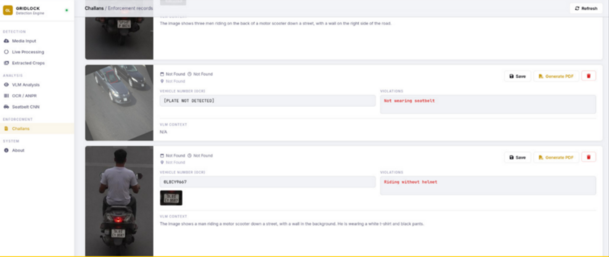

# GRIDLOCK -- Challans Dashboard

AI-powered traffic violation detection and automated challan generation, from photo to penalty in seconds.


---

## Getting Started

### 1. Install dependencies
```bash
pip install -r requirements.txt
```

### 2. Run the Flask server
```bash
python app.py
```

### 3. Open the dashboard
Navigate to `localhost:5000` in your browser (or the address printed by Flask).

**GPU recommended.** The pipeline will use CUDA automatically if available -- `torch.cuda.is_available()` is checked at startup.


## Please refer [project report here ](Flipkart%20GRiDlock%20report.pdf) for detailed system architecture

---


## What It Does

Upload a traffic photo, the system detects violations, and generates an official challan PDF.

Under the hood, a multi-stage computer vision pipeline runs:

| Stage | What happens |
|---|---|
| Image ingestion | Photo uploaded via dashboard or API |
| Vehicle detection | YOLO locates every vehicle in the frame |
| Violation detection | Checks for **no helmet**, **no seatbelt**, **triple riding**, **stop-line crossing** |
| ANPR / OCR | EasyOCR reads the licence plate |
| GPS reverse-geocode | EXIF tags to human-readable location via Nominatim |
| Challan PDF | Auto-generated report with violation snapshot and plate number |

---

## Models

| File | Purpose |
|---|---|
| `traffic_yolo_best.pt` | Primary traffic violation detector |
| `yolo_vehicle_best.pt` | Vehicle localisation |
| `anpr_yolo_best.pt` | Licence-plate region detector |
| `mobilenet_seatbelt_best.pt` | Seatbelt crop classifier |
| `best(3).pt` | Auxiliary detection model |

Florence-2 (transformer VLM) is available as an optional fallback -- it only activates when YOLO finds a vehicle context but no direct violation class. It never overrides YOLO detections.

---

## Project Structure

```
Challans Dashboard/
├── app.py                          # Flask server -- REST API + task queue
├── pipeline_core.py                # Core detection & challan pipeline
├── traffic_violation_pipeline_v2.py
├── video_processing.py             # Video frame extraction & processing
├── video_core.py
├── seatbel_detection_cnn.py        # Seatbelt CNN training & inference
├── seatbelt_cnn_core.py
├── seatbelt_crop_classifier.py
├── stop_line_detection.py          # Stop-line crossing detector
├── index.html                      # Main dashboard UI
├── add_challan.html                # Manual challan entry UI
├── models/                         # Trained model weights (.pt)
├── data/
│   ├── uploads/                    # Incoming images/videos
│   ├── challans/                   # Generated challan PDFs
│   └── extracted/                  # Cropped violation frames
└── requirements.txt
```

---

## Tech Stack

- **Backend** -- Flask, Python
- **CV / Detection** -- [Ultralytics YOLO](https://github.com/ultralytics/ultralytics), OpenCV, scikit-image
- **OCR** -- EasyOCR
- **Deep Learning** -- PyTorch, torchvision, timm, transformers
- **PDF Generation** -- fpdf2
- **Geocoding** -- geopy + Nominatim (no API key needed)
- **Frontend** -- Vanilla HTML / CSS / JS

---

Built for **GRIDLOCK 2** -- a traffic-tech hackathon submission focused on automated enforcement tooling.
