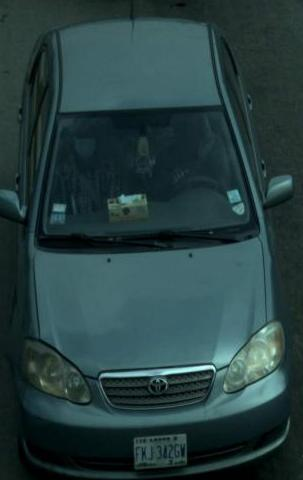
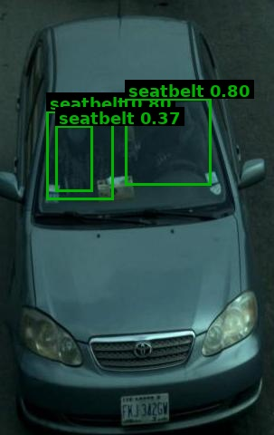

# Traffic Violation Challan

| Field | Value |
|---|---|
| Challan ID | 170B7E35 |
| Date and Time | 2026-06-23 10:08:52 |
| Source Image | extracted_1782189531_0.jpg |
| Verdict | CLEAN |
| Registration Number | [PLATE NOT DETECTED] |
| Total Fine | INR 0 |

## Violations

_None detected_

## VLM Description

## VLM/YOLO Evidence

_No extra evidence text._

## YOLO Detections

| Class | Confidence | Bounding Box |
|---|---:|---|
| seatbelt | 0.803 | [51, 122, 125, 220] |
| seatbelt | 0.801 | [138, 108, 233, 204] |
| seatbelt | 0.373 | [61, 138, 102, 211] |

## Images

| Original | YOLO Marked | Plate OCR |
|---|---|---|
|  |  |  |

## No-Helmet Crops

_No confirmed no-helmet crops._
