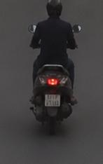
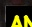

# Traffic Violation Challan

| Field | Value |
|---|---|
| Challan ID | 1F77B83E |
| Date and Time | 2026-06-23 14:48:18 |
| Source Image | extracted_1782206268_0.jpg |
| Verdict | CLEAN |
| Registration Number | [OCR FAILED] |
| Total Fine | INR 0 |

## Violations

_None detected_

## VLM Description

The image shows a man riding a motor scooter down a street, wearing a black outfit and a helmet.

## VLM/YOLO Evidence

- VLM caption (on full frame): The image shows a man riding a motor scooter down a street, wearing a black outfit and a helmet.

## YOLO Detections

| Class | Confidence | Bounding Box |
|---|---:|---|
| helmet | 0.505 | [65, 0, 89, 21] |
| license_plate | 0.355 | [63, 132, 87, 153] |

## Images

| Original | YOLO Marked | Plate OCR |
|---|---|---|
|  |  |  |

## No-Helmet Crops

_No confirmed no-helmet crops._
