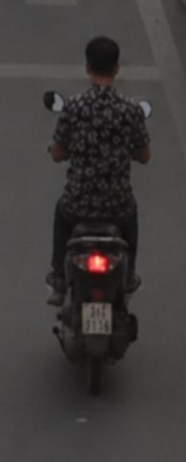
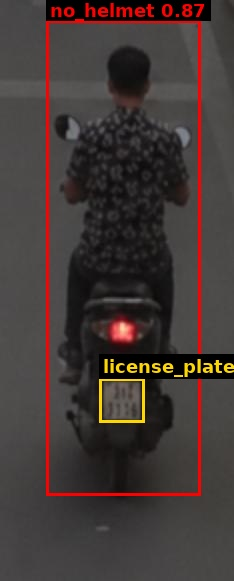
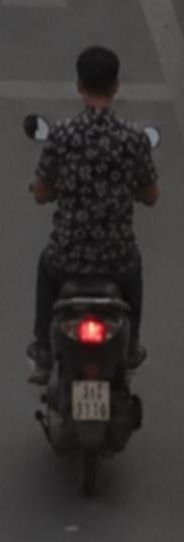

# Traffic Violation Challan

| Field | Value |
|---|---|
| Challan ID | 4A8BA5FB |
| Date and Time | 2026-06-22 23:10:39 |
| Source Image | extracted_1782149983_9.jpg |
| Verdict | VIOLATION |
| Registration Number | [OCR FAILED] |
| Total Fine | INR 1000 |

## Violations

- Riding without helmet

## VLM Description

The image shows a man riding a motor scooter down a street, wearing a black shirt.

## VLM/YOLO Evidence

- YOLO detected: Riding without helmet
- VLM caption (on crop): The image shows a man riding a motor scooter down a street, wearing a black shirt.

## YOLO Detections

| Class | Confidence | Bounding Box |
|---|---:|---|
| no_helmet | 0.873 | [46, 20, 200, 495] |
| license_plate | 0.364 | [99, 378, 144, 422] |

## Images

| Original | YOLO Marked | Plate OCR |
|---|---|---|
|  |  |  |

## No-Helmet Crops

-  conf=0.87
