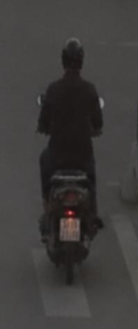
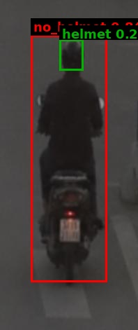

# Traffic Violation Challan

| Field | Value |
|---|---|
| Challan ID | 539771F6 |
| Date and Time | 2026-06-22 23:10:21 |
| Source Image | extracted_1782149983_3.jpg |
| Verdict | CLEAN |
| Registration Number | [PLATE NOT DETECTED] |
| Total Fine | INR 0 |

## Violations

_None detected_

## VLM Description

The image shows a man riding a motorcycle down a street at night, wearing a black outfit and a helmet. The street is illuminated by the street lights, and the man is silhouetted against the night sky.

## VLM/YOLO Evidence

- VLM caption (on full frame): The image shows a man riding a motorcycle down a street at night, wearing a black outfit and a helmet. The street is ill

## YOLO Detections

| Class | Confidence | Bounding Box |
|---|---:|---|
| helmet | 0.256 | [85, 56, 119, 100] |

## Images

| Original | YOLO Marked | Plate OCR |
|---|---|---|
|  |  |  |

## No-Helmet Crops

_No confirmed no-helmet crops._
