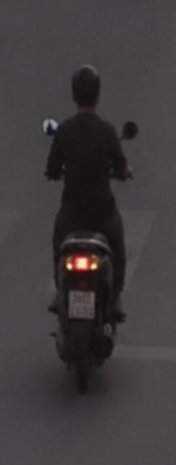
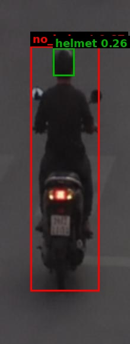

# Traffic Violation Challan

| Field | Value |
|---|---|
| Challan ID | 681D9CEC |
| Date and Time | 2026-06-23 00:34:21 |
| Source Image | extracted_1782155031_2.jpg |
| Verdict | CLEAN |
| Registration Number | [PLATE NOT DETECTED] |
| Total Fine | INR 0 |

## Violations

_None detected_

## VLM Description

The image shows a man riding a motor scooter down a street at night. He is wearing a black outfit and a helmet, and the scooter has a number plate.

## VLM/YOLO Evidence

- VLM caption (on full frame): The image shows a man riding a motor scooter down a street at night. He is wearing a black outfit and a helmet, and the 

## YOLO Detections

| Class | Confidence | Bounding Box |
|---|---:|---|
| helmet | 0.265 | [89, 80, 125, 127] |

## Images

| Original | YOLO Marked | Plate OCR |
|---|---|---|
|  |  |  |

## No-Helmet Crops

_No confirmed no-helmet crops._
