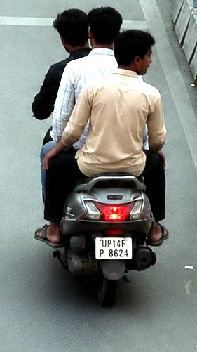
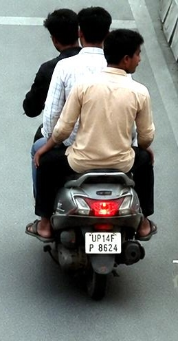

# Traffic Violation Challan

| Field | Value |
|---|---|
| Challan ID | 81DB9CBF |
| Date and Time | 2026-06-23 18:15:36 |
| Source Image | extracted_1782218734_3.jpg |
| Verdict | VIOLATION |
| Registration Number | UP14FP8624 |
| Total Fine | INR 1000 |

## Violations

- Riding without helmet

## VLM Description

## VLM/YOLO Evidence

- YOLO detected: Riding without helmet

## YOLO Detections

| Class | Confidence | Bounding Box |
|---|---:|---|
| no_helmet | 0.846 | [33, 8, 250, 452] |
| license_plate | 0.626 | [133, 332, 190, 370] |
| rider | 0.309 | [37, 8, 176, 357] |

## Images

| Original | YOLO Marked | Plate OCR |
|---|---|---|
|  |  |  |

## No-Helmet Crops

-  conf=0.85
