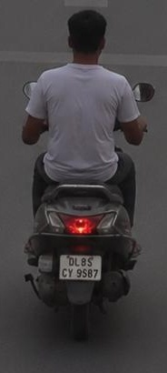

# Traffic Violation Challan

| Field | Value |
|---|---|
| Challan ID | 8DCE4E29 |
| Date and Time | 2026-06-23 20:34:59 |
| Location | Not Found |
| Source Image | extracted_1782227093_3.jpg |
| Verdict | VIOLATION |
| Registration Number | 0L8CY9667 |
| Total Fine | INR 1000 |

## Violations

- Riding without helmet

## VLM Description

## VLM/YOLO Evidence

- YOLO detected: Riding without helmet

## YOLO Detections

| Class | Confidence | Bounding Box |
|---|---:|---|
| no_helmet | 0.891 | [38, 5, 192, 374] |
| license_plate | 0.752 | [86, 276, 136, 310] |

## Images

| Original | YOLO Marked | Plate OCR |
|---|---|---|
|  |  |  |

## No-Helmet Crops

-  conf=0.89
