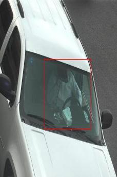
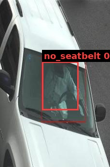

# Traffic Violation Challan

| Field | Value |
|---|---|
| Challan ID | 8F6F5B7E |
| Date and Time | 2026-06-23 10:08:05 |
| Source Image | extracted_1782189485_0.jpg |
| Verdict | VIOLATION |
| Registration Number | [PLATE NOT DETECTED] |
| Total Fine | INR 1000 |

## Violations

- Not wearing seatbelt

## VLM Description

## VLM/YOLO Evidence

- YOLO detected: Not wearing seatbelt

## YOLO Detections

| Class | Confidence | Bounding Box |
|---|---:|---|
| no_seatbelt | 0.718 | [87, 127, 162, 227] |

## Images

| Original | YOLO Marked | Plate OCR |
|---|---|---|
|  |  |  |

## No-Helmet Crops

_No confirmed no-helmet crops._
