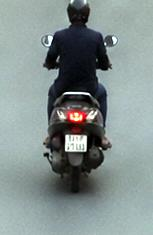

# Traffic Violation Challan

| Field | Value |
|---|---|
| Challan ID | 970ACB69 |
| Date and Time | 2026-06-23 18:02:50 |
| Source Image | extracted_1782217958_0.jpg |
| Verdict | CLEAN |
| Registration Number | 41104 |
| Total Fine | INR 0 |

## Violations

_None detected_

## VLM Description

The image shows a man wearing a helmet and riding a motor scooter down a street. He is wearing a black outfit and the scooter has a number plate.

## VLM/YOLO Evidence

- VLM caption (on full frame): The image shows a man wearing a helmet and riding a motor scooter down a street. He is wearing a black outfit and the sc

## YOLO Detections

| Class | Confidence | Bounding Box |
|---|---:|---|
| helmet | 0.434 | [65, 0, 92, 21] |
| license_plate | 0.359 | [63, 132, 88, 152] |

## Images

| Original | YOLO Marked | Plate OCR |
|---|---|---|
|  |  |  |

## No-Helmet Crops

_No confirmed no-helmet crops._
