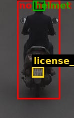

# Traffic Violation Challan

| Field | Value |
|---|---|
| Challan ID | AE2249B6 |
| Date and Time | 2026-06-23 18:46:48 |
| Source Image | extracted_1782220605_0.jpg |
| Verdict | CLEAN |
| Registration Number | [OCR FAILED] |
| Total Fine | INR 0 |

## Violations

_None detected_

## VLM Description

## VLM/YOLO Evidence

_No extra evidence text._

## YOLO Detections

| Class | Confidence | Bounding Box |
|---|---:|---|
| helmet | 0.505 | [65, 0, 89, 21] |
| license_plate | 0.355 | [63, 132, 87, 153] |

## Images

| Original | YOLO Marked | Plate OCR |
|---|---|---|
|  |  |  |

## No-Helmet Crops

_No confirmed no-helmet crops._
