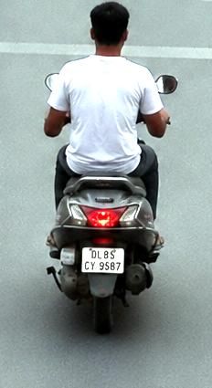
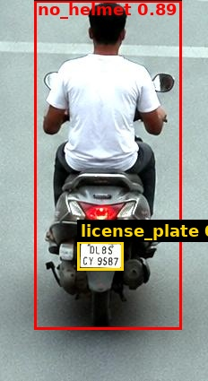
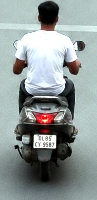

# Traffic Violation Challan

| Field | Value |
|---|---|
| Challan ID | C57BACAD |
| Date and Time | 2026-06-23 18:14:17 |
| Source Image | extracted_1782218655_2.jpg |
| Verdict | VIOLATION |
| Registration Number | DL85CY9567 |
| Total Fine | INR 1000 |

## Violations

- Riding without helmet

## VLM Description

## VLM/YOLO Evidence

- YOLO detected: Riding without helmet

## YOLO Detections

| Class | Confidence | Bounding Box |
|---|---:|---|
| no_helmet | 0.891 | [38, 0, 202, 367] |
| license_plate | 0.722 | [86, 269, 137, 301] |

## Images

| Original | YOLO Marked | Plate OCR |
|---|---|---|
|  |  |  |

## No-Helmet Crops

-  conf=0.89
