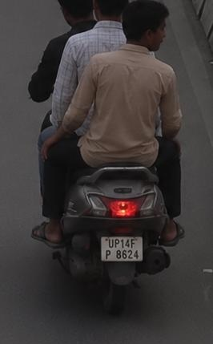

# Traffic Violation Challan

| Field | Value |
|---|---|
| Challan ID | C62A42AD |
| Date and Time | 2026-06-23 00:41:03 |
| Source Image | extracted_1782155432_4.jpg |
| Verdict | VIOLATION |
| Registration Number | UP14FP8624 |
| Total Fine | INR 1000 |

## Violations

- Riding without helmet

## VLM Description

The image shows three men riding on the back of a motor scooter down a street, with a wall on the right side of the road.

## VLM/YOLO Evidence

- YOLO detected: Riding without helmet
- VLM caption (on crop): The image shows three men riding on the back of a motor scooter down a street, with a wall on the right side of the road

## YOLO Detections

| Class | Confidence | Bounding Box |
|---|---:|---|
| no_helmet | 0.845 | [19, 0, 246, 390] |
| license_plate | 0.531 | [120, 290, 180, 328] |

## Images

| Original | YOLO Marked | Plate OCR |
|---|---|---|
|  |  |  |

## No-Helmet Crops

-  conf=0.84
