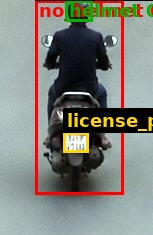

# Traffic Violation Challan

| Field | Value |
|---|---|
| Challan ID | CA212533 |
| Date and Time | 2026-06-23 18:15:36 |
| Source Image | extracted_1782218734_0.jpg |
| Verdict | CLEAN |
| Registration Number | 104 |
| Total Fine | INR 0 |

## Violations

_None detected_

## VLM Description

## VLM/YOLO Evidence

_No extra evidence text._

## YOLO Detections

| Class | Confidence | Bounding Box |
|---|---:|---|
| helmet | 0.434 | [65, 0, 92, 21] |
| license_plate | 0.359 | [63, 132, 88, 152] |

## Images

| Original | YOLO Marked | Plate OCR |
|---|---|---|
|  |  |  |

## No-Helmet Crops

_No confirmed no-helmet crops._
