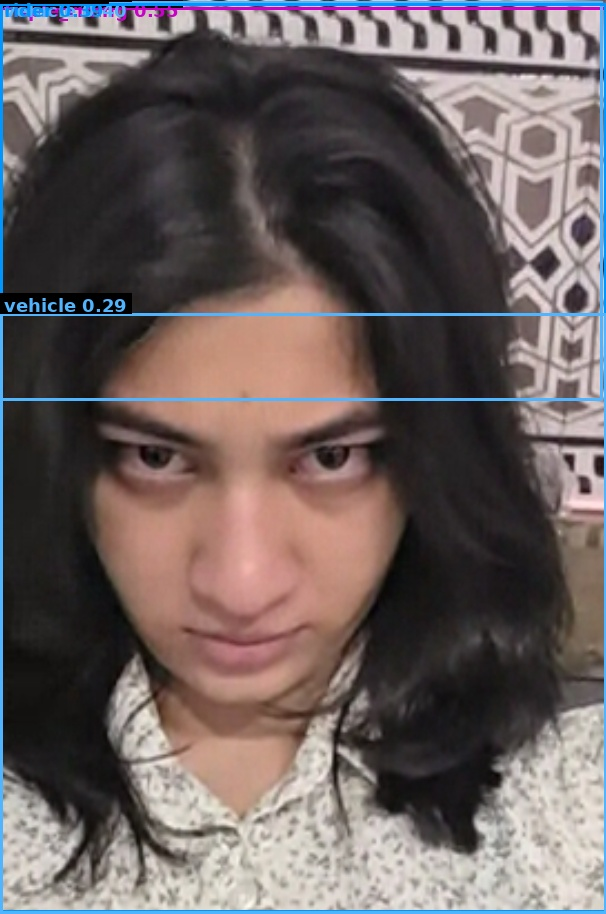

# Traffic Violation Challan

| Field | Value |
|---|---|
| Challan ID | CDC7D6B5 |
| Date and Time | 2026-06-23 11:40:58 |
| Source Image | 1782195052_wayshot-2026_05_20-19_36_07.png |
| Verdict | VIOLATION |
| Registration Number | [PLATE NOT DETECTED] |
| Total Fine | INR 2000 |

## Violations

- Triple Riding

## VLM Description

The image shows a woman with long black hair wearing a white shirt, standing in front of a wall.

## VLM/YOLO Evidence

- YOLO detected: Triple Riding
- VLM caption (on full frame): The image shows a woman with long black hair wearing a white shirt, standing in front of a wall.

## YOLO Detections

| Class | Confidence | Bounding Box |
|---|---:|---|
| triple_riding | 0.555 | [0, 7, 606, 912] |
| vehicle | 0.396 | [0, 1, 602, 400] |
| rider | 0.395 | [0, 3, 606, 912] |
| vehicle | 0.288 | [0, 313, 606, 913] |

## Images

| Original | YOLO Marked | Plate OCR |
|---|---|---|
|  |  |  |

## No-Helmet Crops

_No confirmed no-helmet crops._
