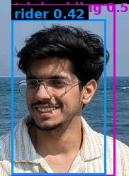

# Traffic Violation Challan

| Field | Value |
|---|---|
| Challan ID | E7262B75 |
| Date and Time | 2026-06-23 11:39:06 |
| Source Image | extracted_1782194928_1.jpg |
| Verdict | VIOLATION |
| Registration Number | [PLATE NOT DETECTED] |
| Total Fine | INR 2000 |

## Violations

- Triple Riding

## VLM Description

The image shows a man wearing glasses and a striped shirt, smiling at the camera while standing in front of a vast expanse of water and sky.

## VLM/YOLO Evidence

- YOLO detected: Triple Riding
- VLM caption (on full frame): The image shows a man wearing glasses and a striped shirt, smiling at the camera while standing in front of a vast expan

## YOLO Detections

| Class | Confidence | Bounding Box |
|---|---:|---|
| triple_riding | 0.560 | [16, 5, 162, 248] |
| rider | 0.417 | [16, 27, 149, 246] |

## Images

| Original | YOLO Marked | Plate OCR |
|---|---|---|
|  |  |  |

## No-Helmet Crops

_No confirmed no-helmet crops._
