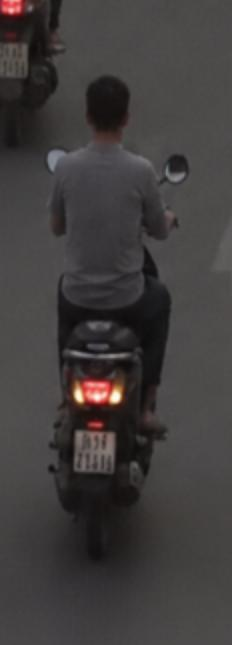
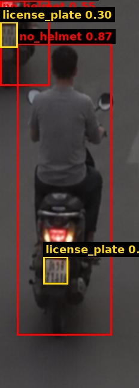
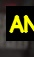
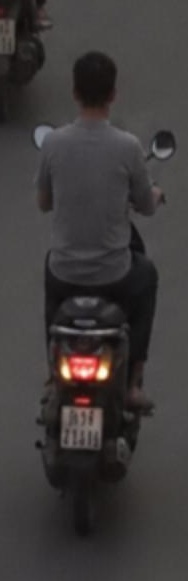

# Traffic Violation Challan

| Field | Value |
|---|---|
| Challan ID | F1DF40AC |
| Date and Time | 2026-06-23 00:34:41 |
| Source Image | extracted_1782155031_7.jpg |
| Verdict | VIOLATION |
| Registration Number | [OCR FAILED] |
| Total Fine | INR 1000 |

## Violations

- Riding without helmet

## VLM Description

The image shows a man riding a motorcycle down a street next to another motorbike. The man is wearing a grey t-shirt and black pants, and the street is lined with other vehicles.

## VLM/YOLO Evidence

- YOLO detected: Riding without helmet
- VLM caption (on crop): The image shows a man riding a motorcycle down a street next to another motorbike. The man is wearing a grey t-shirt and

## YOLO Detections

| Class | Confidence | Bounding Box |
|---|---:|---|
| no_helmet | 0.866 | [28, 72, 186, 557] |
| no_helmet | 0.552 | [0, 0, 82, 142] |
| license_plate | 0.304 | [0, 36, 29, 79] |
| license_plate | 0.256 | [72, 426, 113, 472] |

## Images

| Original | YOLO Marked | Plate OCR |
|---|---|---|
|  |  |  |

## No-Helmet Crops

-  conf=0.87
-  conf=0.55
