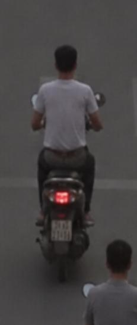
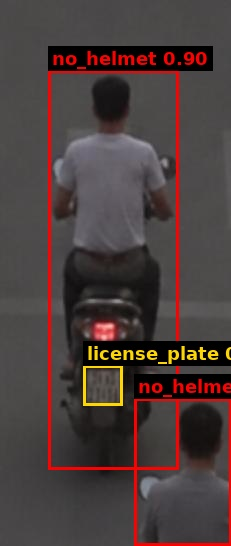
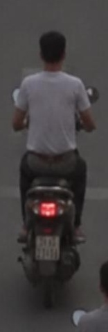

# Traffic Violation Challan

| Field | Value |
|---|---|
| Challan ID | F7F6B597 |
| Date and Time | 2026-06-22 23:09:55 |
| Source Image | extracted_1782149983_0.jpg |
| Verdict | VIOLATION |
| Registration Number | [OCR FAILED] |
| Total Fine | INR 1000 |

## Violations

- Riding without helmet

## VLM Description

The image shows a man riding a scooter down a street next to another man. The man on the scooter is wearing a white t-shirt and black pants, while the other man is standing to the side of the road.

## VLM/YOLO Evidence

- YOLO detected: Riding without helmet
- VLM caption (on crop): The image shows a man riding a scooter down a street next to another man. The man on the scooter is wearing a white t-sh

## YOLO Detections

| Class | Confidence | Bounding Box |
|---|---:|---|
| no_helmet | 0.897 | [48, 70, 178, 469] |
| no_helmet | 0.740 | [134, 398, 231, 545] |
| license_plate | 0.286 | [83, 365, 122, 405] |

## Images

| Original | YOLO Marked | Plate OCR |
|---|---|---|
|  |  |  |

## No-Helmet Crops

-  conf=0.90
-  conf=0.74
